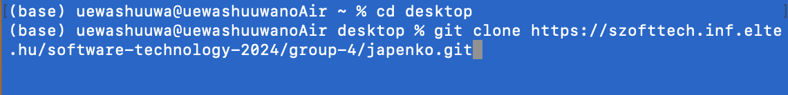
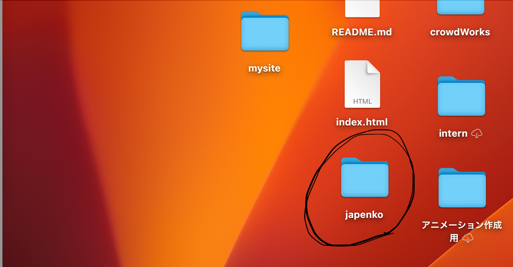
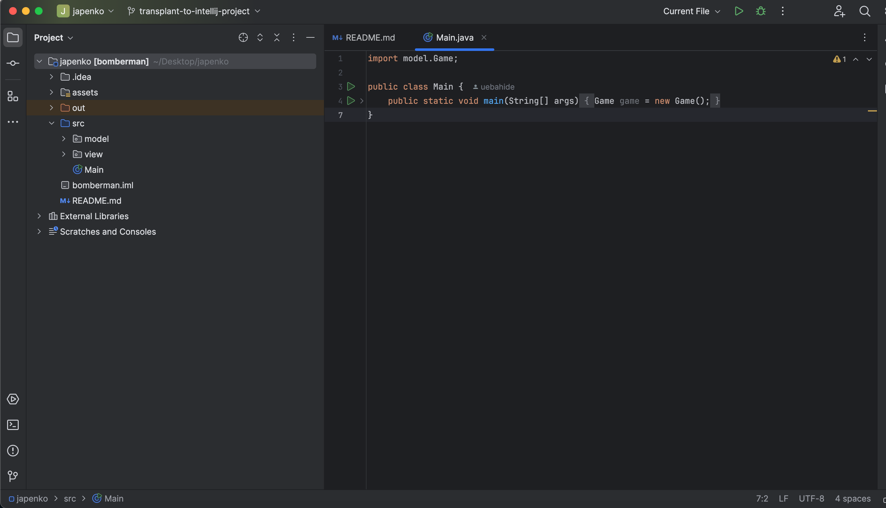
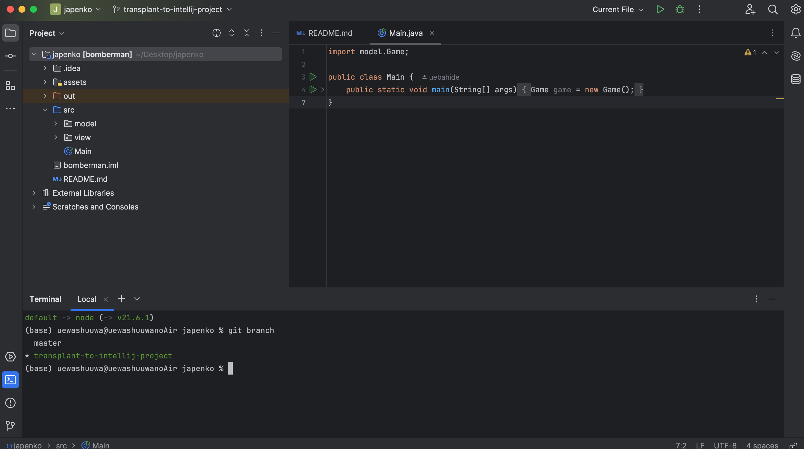
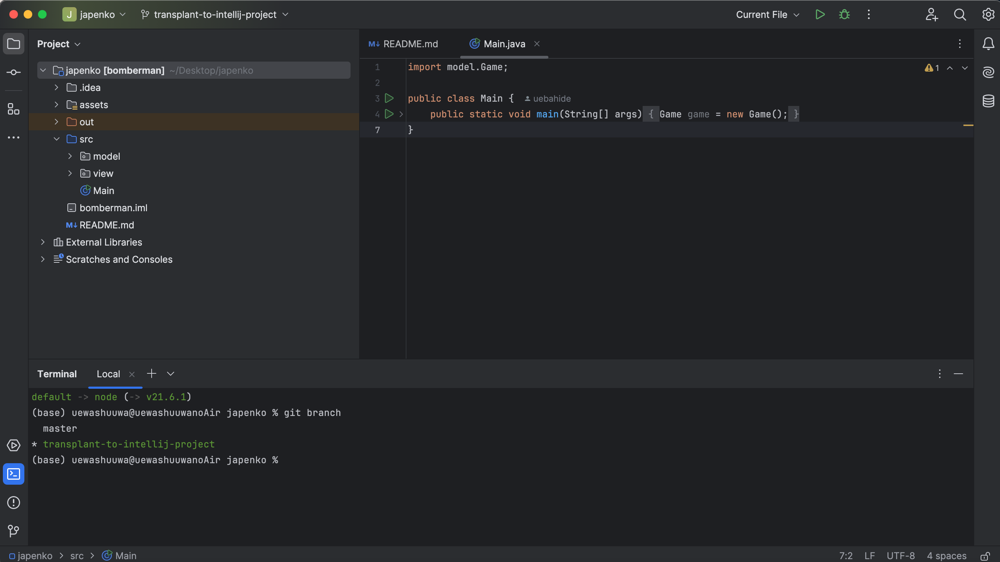

- Install Intellij idea
- https://www.jetbrains.com/community/education/#students
- On the above intellij idea installation, please create account and register your student status, then you can use full version for free.
- In your environment (for example "desktop"), execute the following command
- $git clone https://szofttech.inf.elte.hu/software-technology-2024/group-4/japenko.git

- you will have "japenko" file

- Open it with intellij idea
start click following icon. terminal window will start.

- In the terminal, execute the following code
- $git branch -b transplant-to-intellij-project origin/transplant-to-intellij-project
- then you have your new branch in your local git which content is exactory the same as "transplant-to-intellij-project" branch (execute $git branch. then if you can ses as following, you are successful.)

- click "src/Main" file
- Run this file. 
